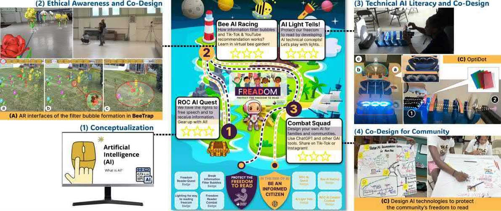

---

##### Download

+ [Paper](paper1.pdf)

---

##### Abstract

Fostering AI literacy among youth from diverse communities with unique values and challenges is crucial.  
We developed a summer camp with the theme **“Protect the Freedom to READ”**. By inviting middle-school students to collaboratively design AI for their community, the camp deepened their AI understanding and empowered them to create applications that honor their community’s values.  

Two embodied learning tools supported the camp: **BeeTrap** (exploring ethical issues like filter bubbles) and **Briteller** (revealing technical foundations of AI recommendation systems). Co-design activities transferred AI literacy to higher-order thinking (apply/create), while positioning students as advocates for ethical, inclusive technology. :contentReference[oaicite:1]{index=1}

---

##### Figure: Camp overview



---

##### Citation

Zhou, Xiaofei, Gong, Yunfan, Yu, Yichen, Zhang, Yi, Smith, Jeremy, & Bai, Zhen. 2025.  
“Design AI for My Community: A Case Study of Collaborative Learning in a Freedom-to-Read Summer Camp.”  
*Proceedings of the International Conference of the Learning Sciences (ICLS 2025)*, 1295–1299. ISLS.  

```BibTeX
@inproceedings{zhou2025design,
  title={Design AI for My Community: A Case Study of Collaborative Learning in a Freedom-to-Read Summer Camp},
  author={Zhou, Xiaofei and Gong, Yunfan and Yu, Yichen and Zhang, Yi and Smith, Jeremy and Bai, Zhen},
  booktitle={Proceedings of the 19th International Conference of the Learning Sciences-ICLS 2025, pp. 1295-1299},
  year={2025},
  organization={International Society of the Learning Sciences}
}
