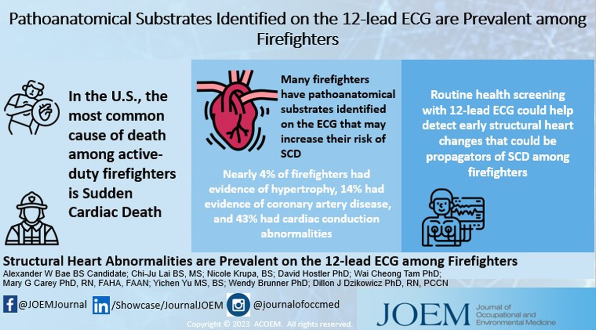

---

##### Download

+ [Paper](paper2.pdf)

---

##### Abstract

**Objective** — Sudden cardiac death (SCD) is the leading cause of on-duty mortality among U.S. firefighters.  
This study aimed to determine the prevalence of ECG-detectable pathoanatomical substrates of SCD over 9 years.  

**Methods** — Routine 12-lead ECGs were collected from 2011–2019. Automated MUSE measurements and interpretation statements were used. Descriptive, comparative, and longitudinal analyses were performed (P < 0.05).  

**Results** — Among analyzed ECGs (n = 465), 42.6% showed conduction abnormalities and 14.2% showed coronary disease indicators; no time-dependent changes were observed.  

**Conclusions** — Routine 12-lead ECGs among firefighters may help detect structural heart defects that increase SCD risk.

---

##### Figure: Example ECG markers



---

##### Citation

Bae, Alexander W., Lai, Chi-Ju, Yu, Yichen, Krupa, Nicole, Hostler, David, Tam, Wai Cheong, Carey, Mary G., Brunner, Wendy M., & Dzikowicz, Dillon J. (2025).  
“Structural Heart Abnormalities Are Prevalent on the 12-Lead Electrocardiogram Among Firefighters.”  
*Journal of Occupational and Environmental Medicine*, 67(8), e555–e561. DOI: [10.1097/JOM.0000000000003409](https://doi.org/10.1097/JOM.0000000000003409).

```BibTeX
@article{BaeEtAl2025_JOEM_Firefighters_ECG,
  author    = {Alexander W. Bae and Chi-Ju Lai and Yichen Yu and Nicole Krupa and David Hostler and Wai Cheong Tam and Mary G. Carey and Wendy M. Brunner and Dillon J. Dzikowicz},
  title     = {Structural Heart Abnormalities Are Prevalent on the 12-Lead Electrocardiogram Among Firefighters},
  journal   = {Journal of Occupational and Environmental Medicine},
  year      = {2025},
  volume    = {67},
  number    = {8},
  pages     = {e555--e561},
  doi       = {10.1097/JOM.0000000000003409},
  publisher = {American College of Occupational and Environmental Medicine},
  url       = {https://journals.lww.com/joem/abstract/2025/08000/structural_heart_abnormalities_are_prevalent_on.20.aspx}
}
