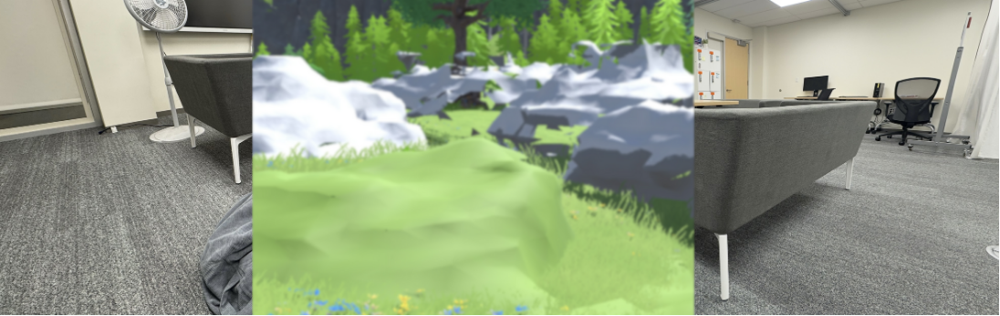

---

##### Download

+ [Paper](paper3.pdf)


---

##### Abstract

We introduce *Chameleon*, a system that substitutes real-world obstacles with virtual counterparts in a risk-level–aware manner. By adapting visual salience, geometry, and semantics to contextual risk, Chameleon preserves immersion while improving users’ spatial awareness and safety. In a controlled study, participants achieved comparable task performance to baseline VR while demonstrating fewer near-collision events and reporting strong presence and clarity of risk cues.

---

##### Figure



---

##### Citation

Yu, Yichen (Andy), et al. 2025. "Chameleon: Unobtrusive Substitution of Real-World Obstacles in VR with Risk-Level–Aware Adaptation." *CHI ’25 Extended Abstracts*. ACM.

```BibTeX
@inproceedings{10.1145/3706599.3719779,
author = {Yu, Yichen and Jin, Qiao},
title = {Chameleon: Unobtrusive Substitution of Real-World Obstacles in VR with Risk-Level-Aware Adaptation},
year = {2025},
isbn = {9798400713958},
publisher = {Association for Computing Machinery},
address = {New York, NY, USA},
url = {https://doi.org/10.1145/3706599.3719779},
doi = {10.1145/3706599.3719779},
abstract = {In VR environments, free movement in real space enhances immersion but increases the risk of collisions with real-world obstacles. Prior solutions investigated using substitute obstacles with context-related digital objects in VR but often treat all obstacles uniformly without considering their varying levels of risk. This oversight might result in reduced awareness for high-risk obstacles and a missed opportunity to utilize low-risk objects to enhance haptic feedback and interactivity in VR. In this study, we propose Chameleon, a system that classifies real-world obstacles by their varying risk levels and substitutes them with context-related virtual objects in VR. The substitutions are designed to align with the obstacles’ real-world risk levels to ensure both safety and immersion. A preliminary heuristic evaluation assessed the usability of using visual textures to implicitly represent obstacle risk levels.},
booktitle = {Proceedings of the Extended Abstracts of the CHI Conference on Human Factors in Computing Systems},
articleno = {131},
numpages = {5},
keywords = {Virtual Reality, Obstacle Avoidance, Cross-reality System, Safety},
location = {
},
series = {CHI EA '25}
}
