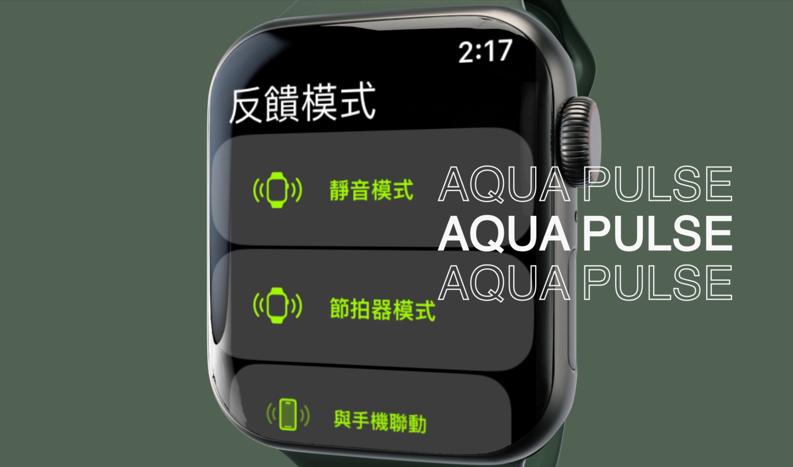

---

##### Download

+ [Paper](paper4.pdf)

---

##### Abstract

Visually impaired individuals often require a guide runner to safely participate in outdoor running. Traditional methods, such as verbal cues or physical tethers, can be mentally taxing, physically restrictive, and reinforce dependency. **RunPacer** introduces a smartwatch-based vibrotactile feedback system that delivers synchronized rhythmic pulses to both runners, enabling intuitive coordination and reducing cognitive load. By supporting both fixed and adaptive cadence modes, RunPacer promotes shared agency and comfort. This poster presents the system design, heuristic evaluation, and future directions for inclusive co-running technologies.

---

##### Figure



---

##### Citation

Yu, Yichen, Xu, Huan-Song, & Lin, Ming-Yen. 2025.  
*RunPacer: A Smartwatch-Based Vibrotactile Feedback System for Symmetric Co-Running by Visually Impaired Individuals and Guides.*  
In **Proceedings of the 27th International ACM SIGACCESS Conference on Computers and Accessibility (ASSETS ’25)**, October 26–29, 2025, Denver, CO, USA. ACM. https://doi.org/10.1145/3663547.3759738

```BibTeX
@inproceedings{yu2025runpacer,
  author    = {Yu, Yichen and Xu, Huan-Song and Lin, Ming-Yen},
  title     = {RunPacer: A Smartwatch-Based Vibrotactile Feedback System for Symmetric Co-Running by Visually Impaired Individuals and Guides},
  booktitle = {Proceedings of the 27th International ACM SIGACCESS Conference on Computers and Accessibility (ASSETS '25)},
  year      = {2025},
  pages     = {1--4},
  publisher = {ACM},
  address   = {Denver, CO, USA},
  doi       = {10.1145/3663547.3759738},
  isbn      = {979-8-4007-0676-9/2025/10}
}
