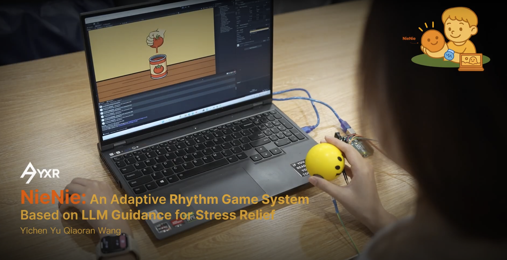

---

##### Download

+ [Paper](paper5.pdf)

---

##### Abstract

Today’s young people face increasing psychological stress due to academic pressure, social isolation, and digital distractions. Traditional stress management apps often rely on static scripts, limiting their effectiveness. **NieNie** introduces an adaptive rhythmic system that combines wearable-based stress detection, rhythm biofeedback, and real-time guidance from large language models (LLMs).  

By connecting physiological signals (e.g., HRV) with interactive squeezing gameplay, NieNie dynamically generates rhythm-based interventions and supportive language prompts. This embodied loop fosters immersive emotional regulation, offering a playful yet effective approach to stress relief. Preliminary studies highlight its potential to transform stress management into an adaptive, engaging, and scalable experience.

---

##### Figure



---

##### Citation

Yu, Yichen, & Wang, Qiaoran. 2025.  
*NieNie: Adaptive Rhythmic System for Stress Relief with LLM-Based Guidance.*  
In **Proceedings of the 2025 ACM International Symposium on Wearable Computers (ISWC ’25)**, October 12–16, 2025, Espoo, Finland. ACM. https://doi.org/10.1145/3714394.3750586

```BibTeX
@inproceedings{yu2025nienie,
  author    = {Yu, Yichen and Wang, Qiaoran and Meng, [Co-Author]},
  title     = {NieNie: Adaptive Rhythmic System for Stress Relief with LLM-Based Guidance},
  booktitle = {Proceedings of the 2025 ACM International Symposium on Wearable Computers (ISWC '25)},
  year      = {2025},
  pages     = {1--5},
  publisher = {ACM},
  address   = {Espoo, Finland},
  doi       = {10.1145/3714394.3750586},
  isbn      = {979-8-4007-1481-8/25/10}
}
