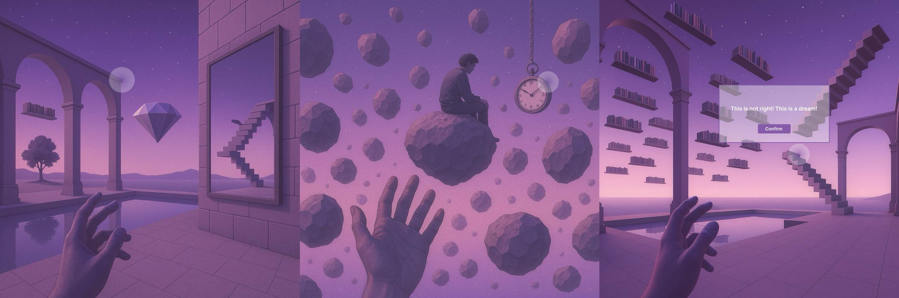

---

##### Download

+ [Paper](paper6.pdf)

---

##### Abstract

Lucid dreaming requires metacognitive awareness and persistent training, making it hard to attain with static, one-size-fits-all tools. **Noetic Dream** proposes a personalized, non‑invasive training system that integrates (1) **LLM‑assisted dream replay** to reconstruct users’ own dream scenes in VR, (2) **gamified reality detection** with designed “surreal anomalies” to cultivate dream awareness, and (3) **open‑monitoring (OM) meditation** with multimodal guidance (visual, auditory, haptics) to stabilize attention and implant lucid intent. Implemented in Unity for Meta Quest 3, the system records interaction data for longitudinal modeling and adaptively adjusts content, aiming to increase lucid dream frequency and quality.

---

##### Figure



---

##### Citation

Wang, Qiaoran, & **Yu, Yichen**. 2025.  
*Noetic Dream: A Personalized VR and Meditation System for Lucid Dream Training.*  
In **UIST Adjunct ’25** (The 38th ACM Symposium on User Interface Software and Technology Adjunct), September 28–October 1, 2025, **Busan, Republic of Korea**. ACM. https://doi.org/10.1145/3746058.3758424  
*Both authors contributed equally.*

```BibTeX
@inproceedings{wang2025noeticdream,
  author    = {Wang, Qiaoran and Yu, Yichen},
  title     = {Noetic Dream: A Personalized VR and Meditation System for Lucid Dream Training},
  booktitle = {Proceedings of the 38th Annual ACM Symposium on User Interface Software and Technology (UIST Adjunct '25)},
  year      = {2025},
  address   = {Busan, Republic of Korea},
  publisher = {ACM},
  pages     = {1--3},
  doi       = {10.1145/3746058.3758424},
  isbn      = {979-8-4007-2036-9/2025/09}
}
