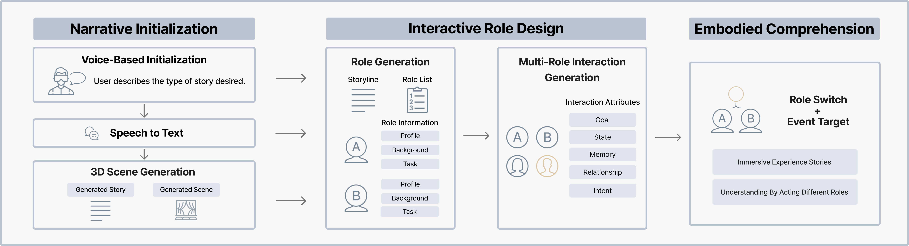

---

##### Download

+ [Paper](paper7.pdf)

---

##### Abstract

**GenLARP** is a generative AI system that enables immersive live action role play (LARP) in extended reality. It dynamically creates **3D environments** and **AI-driven characters** using large language models (LLMs), allowing participants to collaboratively co-create narratives, interact with adaptive non-player characters, and explore emergent scenarios.  

The system supports **embodied learning and creativity**, letting players physically enact roles while the AI adapts plots, environments, and dialogue in real time. We present the design framework, early prototype implementation in Unity, and opportunities for using GenLARP in education, training, and collaborative storytelling. This poster highlights challenges of balancing narrative freedom, technical constraints, and ethical concerns in AI-mediated role play.

---

##### Figure



---

##### Citation

Yu, Yichen, Wang, Qiaoran, & Bai, Zhen. 2025.  
*GenLARP: Enabling Immersive Live Action Role Play through LLM-Generated Worlds and Characters.*  
In **ISMAR Adjunct ’25** (IEEE International Symposium on Mixed and Augmented Reality Adjunct), October 15–19, 2025, **[City TBD], [Country TBD]**. IEEE. https://doi.org/10.1109/ISMAR-Adjunct60698.2025.xxxxx  

```BibTeX
@inproceedings{yu2025genlarp,
  author    = {Yu, Yichen and Wang, Qiaoran and Bai, Zhen},
  title     = {GenLARP: Enabling Immersive Live Action Role Play through LLM-Generated Worlds and Characters},
  booktitle = {Proceedings of the IEEE International Symposium on Mixed and Augmented Reality Adjunct (ISMAR Adjunct '25)},
  year      = {2025},
  publisher = {IEEE},
  pages     = {1--3},
  doi       = {10.1109/ISMAR-Adjunct60698.2025.xxxxx},
  isbn      = {978-1-6654-xxxx-x/25}
}
